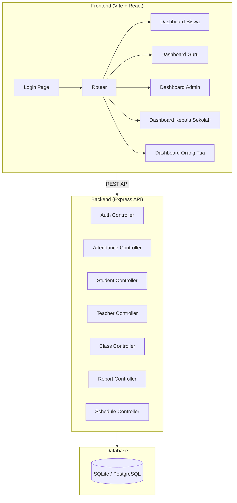

# Aplikasi Absensi Siswa — Implementation Plan (Phase 1 MVP)

## Ringkasan

Membangun sistem absensi digital siswa berbasis web dengan fitur QR code attendance, manajemen data master, laporan & analitik, notifikasi, dan multi-role authentication. Plan ini fokus pada **Fase 1 MVP** (core absensi, data master, laporan harian) dengan arsitektur yang siap di-scale ke Fase 2–4.

---

## User Review Required

> [!IMPORTANT]
> **Database Choice**: Plan ini menggunakan **SQLite** untuk MVP agar mudah di-setup tanpa instalasi database server terpisah. Untuk production, akan dimigrasikan ke PostgreSQL. Apakah Anda ingin langsung menggunakan PostgreSQL dari awal?

> [!IMPORTANT]
> **Scope MVP**: Berdasarkan PRD, Phase 1 mencakup core absensi (QR), manajemen data dasar, dan laporan harian. Fitur notifikasi real-time (push notification, WhatsApp) akan masuk Phase 2. Apakah scope ini sudah sesuai?

> [!WARNING]
> **Mobile App**: PRD menyebutkan Flutter untuk mobile. Plan ini fokus pada **web app (responsive/mobile-first)** terlebih dahulu. Mobile app native akan direncanakan terpisah.

---

## Open Questions

1. **Apakah sudah ada desain visual / branding (logo, warna, font) sekolah yang harus diikuti?** Jika belum, saya akan membuat design system sendiri dengan tema modern.
2. **Apakah ada data dummy (siswa, guru, kelas) yang ingin digunakan untuk testing?** Jika tidak, saya akan generate seed data.
3. **Deployment target**: Apakah akan di-deploy ke cloud tertentu (AWS, GCP, VPS) atau cukup berjalan lokal dulu?
4. **Multi-sekolah**: Apakah MVP ini untuk satu sekolah saja, atau sudah harus support multi-tenant?

---

## Tech Stack

| Komponen | Teknologi | Alasan |
|---|---|---|
| **Frontend** | Vite + React 18 | Fast build, modern DX, ecosystem besar |
| **Styling** | Vanilla CSS + CSS Variables | Fleksibel, no dependency, design system custom |
| **Backend** | Node.js + Express | Sesuai PRD, ecosystem luas untuk API |
| **Database** | SQLite (MVP) → PostgreSQL (prod) | Zero-config untuk development |
| **ORM** | Prisma | Type-safe, migration support, multi-DB |
| **Auth** | JWT (jsonwebtoken + bcrypt) | Stateless auth, multi-role support |
| **QR Code** | `qrcode` (generate) + `html5-qrcode` (scan) | Library ringan, well-maintained |
| **Charts** | Chart.js / Recharts | Dashboard analitik visualisasi |
| **Export** | jsPDF + SheetJS (xlsx) | Export laporan ke PDF & Excel |

---

## Arsitektur Sistem



---

## Struktur Folder

```
absensi_apk/
├── client/                    # Frontend React App
│   ├── public/
│   │   └── favicon.ico
│   ├── src/
│   │   ├── assets/            # Images, fonts, icons
│   │   ├── components/        # Reusable UI components
│   │   │   ├── ui/            # Button, Input, Card, Modal, etc.
│   │   │   ├── layout/        # Sidebar, Header, PageWrapper
│   │   │   └── charts/        # Chart components
│   │   ├── pages/             # Route-level pages
│   │   │   ├── auth/          # Login, ForgotPassword
│   │   │   ├── student/       # Student dashboard, QR scan
│   │   │   ├── teacher/       # Teacher dashboard, manual attendance
│   │   │   ├── admin/         # Admin: CRUD siswa, guru, kelas, jadwal
│   │   │   ├── principal/     # Kepala sekolah dashboard
│   │   │   └── parent/        # Orang tua: monitoring anak
│   │   ├── hooks/             # Custom React hooks
│   │   ├── context/           # Auth context, Theme context
│   │   ├── services/          # API call functions
│   │   ├── utils/             # Helper functions
│   │   ├── styles/            # Global CSS, design tokens
│   │   │   ├── index.css      # Global styles & CSS variables
│   │   │   ├── components.css # Component-level styles
│   │   │   └── pages.css      # Page-level styles
│   │   ├── App.jsx
│   │   └── main.jsx
│   ├── index.html
│   ├── vite.config.js
│   └── package.json
│
├── server/                    # Backend Express API
│   ├── prisma/
│   │   ├── schema.prisma      # Database schema
│   │   └── seed.js            # Seed data
│   ├── src/
│   │   ├── controllers/       # Route handlers
│   │   │   ├── auth.controller.js
│   │   │   ├── attendance.controller.js
│   │   │   ├── student.controller.js
│   │   │   ├── teacher.controller.js
│   │   │   ├── class.controller.js
│   │   │   ├── schedule.controller.js
│   │   │   └── report.controller.js
│   │   ├── middleware/        # Auth, validation, error handling
│   │   │   ├── auth.middleware.js
│   │   │   ├── role.middleware.js
│   │   │   └── error.middleware.js
│   │   ├── routes/            # Route definitions
│   │   │   ├── auth.routes.js
│   │   │   ├── attendance.routes.js
│   │   │   ├── student.routes.js
│   │   │   ├── teacher.routes.js
│   │   │   ├── class.routes.js
│   │   │   ├── schedule.routes.js
│   │   │   └── report.routes.js
│   │   ├── services/          # Business logic
│   │   ├── utils/             # Helpers (QR generation, etc.)
│   │   └── app.js             # Express app setup
│   ├── server.js              # Entry point
│   └── package.json
│
├── .env                       # Environment variables
├── .gitignore
└── README.md
```

---

## Database Schema

```mermaid
erDiagram
    User {
        string id PK
        string email UK
        string password
        string role "ADMIN | GURU | SISWA | KEPALA_SEKOLAH | ORANG_TUA"
        string name
        string phone
        boolean isActive
        datetime createdAt
    }

    Student {
        string id PK
        string nis UK
        string userId FK
        string classId FK
        string parentId FK
        string photo
        string address
    }

    Teacher {
        string id PK
        string nip UK
        string userId FK
        string homeroomClassId FK
    }

    Parent {
        string id PK
        string userId FK
    }

    Class {
        string id PK
        string name "X IPA 1"
        string grade "X, XI, XII"
        string major "IPA, IPS, Bahasa"
        string academicYear "2025/2026"
        boolean isActive
    }

    Schedule {
        string id PK
        string classId FK
        int dayOfWeek "0-6"
        time checkInTime "07:00"
        time checkOutTime "14:00"
        boolean isActive
    }

    Attendance {
        string id PK
        string studentId FK
        string classId FK
        date date
        time checkInTime
        time checkOutTime
        string status "HADIR | SAKIT | IZIN | ALPA | TERLAMBAT"
        string method "QR | MANUAL"
        string notes
        string recordedBy FK
        datetime createdAt
    }

    QRSession {
        string id PK
        string classId FK
        string token UK
        string type "CHECK_IN | CHECK_OUT"
        datetime expiresAt
        string createdBy FK
        boolean isActive
    }

    User ||--o| Student : "has"
    User ||--o| Teacher : "has"
    User ||--o| Parent : "has"
    Student }o--|| Class : "belongs to"
    Student }o--|| Parent : "child of"
    Teacher ||--o| Class : "homeroom"
    Class ||--o{ Schedule : "has"
    Student ||--o{ Attendance : "has"
    Class ||--o{ Attendance : "for"
    Class ||--o{ QRSession : "has"
```

---

## Proposed Changes — Urutan Implementasi

### 1. Project Setup & Infrastructure

#### [NEW] Root project files
- `.gitignore`, `.env`, `README.md`
- Initialize git repository

#### [NEW] `server/` — Backend scaffolding
- `npm init`, install dependencies (express, prisma, jsonwebtoken, bcryptjs, cors, dotenv, qrcode, uuid)
- Prisma schema & initial migration
- Express app setup with middleware (CORS, JSON parser, error handler)
- Seed data (demo users, classes, students)

#### [NEW] `client/` — Frontend scaffolding
- `npx create-vite` dengan React template
- Install dependencies (react-router-dom, axios, html5-qrcode, recharts, jspdf)
- Design system (CSS variables, global styles)

---

### 2. Authentication Module (AUTH-001, AUTH-003)

#### [NEW] Backend: Auth routes & middleware
- `POST /api/v1/auth/login` — Login dengan email + password, return JWT + role
- `POST /api/v1/auth/register` — Register (admin only)
- `GET /api/v1/auth/me` — Get current user profile
- JWT middleware untuk protect routes
- Role-based access control middleware

#### [NEW] Frontend: Login Page
- Halaman login dengan form email/NIS + password
- Role indicator setelah login
- Auth context (React Context) untuk state management
- Protected route wrapper component
- Auto-redirect berdasarkan role

---

### 3. Dashboard Layout & Navigation

#### [NEW] Frontend: Layout Components
- **Sidebar** — Navigation menu sesuai role
- **Header** — User info, logout, notifications badge
- **PageWrapper** — Consistent page layout
- **Responsive** — Collapsible sidebar di mobile, bottom nav

#### Dashboard per role:
| Role | Dashboard Content |
|---|---|
| **Siswa** | QR scan area, status hari ini, riwayat absensi |
| **Guru** | Statistik kelas, daftar siswa, input manual, generate QR |
| **Admin** | Menu manajemen (siswa, guru, kelas, jadwal), statistik global |
| **Kepala Sekolah** | Overview sekolah, grafik kehadiran, alert |
| **Orang Tua** | Status anak hari ini, riwayat, notifikasi |

---

### 4. QR Code Attendance Module (ABS-001 ~ ABS-004)

#### [NEW] Backend: Attendance API
- `POST /api/v1/attendance/qr/generate` — Generate QR session (guru)
- `POST /api/v1/attendance/qr/scan` — Siswa scan QR → record attendance
- `POST /api/v1/attendance/manual` — Guru input manual
- `POST /api/v1/attendance/bulk` — Guru bulk input
- `GET /api/v1/attendance/today` — Get today's attendance
- `GET /api/v1/attendance/history/:studentId` — Riwayat siswa
- Validasi waktu (jam operasional dari Schedule)
- QR token expires setiap 30 detik (dynamic QR)

#### [NEW] Frontend: QR Pages
- **Guru**: Generate QR page — tampilkan QR code yang auto-refresh
- **Siswa**: Scan QR page — camera scanner, konfirmasi absensi
- **Guru**: Manual attendance page — checklist per siswa
- Status indicators (Hadir ✓, Terlambat ⚠️, Izin, Alpa)

---

### 5. Master Data Management (MDM-001 ~ MDM-004)

#### [NEW] Backend: CRUD APIs
- `/api/v1/students` — CRUD siswa (admin only)
- `/api/v1/teachers` — CRUD guru (admin only)
- `/api/v1/classes` — CRUD kelas (admin only)
- `/api/v1/schedules` — CRUD jadwal (admin only)
- Pagination, search, filter support

#### [NEW] Frontend: Admin Pages
- **Data Siswa** — Table with search, add/edit/delete modals
- **Data Guru** — Table with search, add/edit/delete modals
- **Data Kelas** — Table with class assignment
- **Jadwal** — Schedule editor per kelas
- Reusable DataTable component with pagination

---

### 6. Reports & Analytics (RPT-001 ~ RPT-003, RPT-006)

#### [NEW] Backend: Report APIs
- `GET /api/v1/reports/daily?date=&classId=` — Rekap harian
- `GET /api/v1/reports/monthly?month=&year=&classId=` — Rekap bulanan
- `GET /api/v1/reports/student/:id` — Laporan per siswa
- `GET /api/v1/reports/dashboard` — Statistik overview

#### [NEW] Frontend: Report Pages
- **Laporan Harian** — Table kehadiran per kelas per hari
- **Laporan Bulanan** — Summary dengan chart (Recharts)
- **Laporan Siswa** — Detail individual + attendance calendar
- **Dashboard Analitik** — Grafik trend kehadiran, pie chart status

---

### 7. Parent Module

#### [NEW] Frontend: Parent Dashboard
- Lihat status kehadiran anak hari ini
- Riwayat kehadiran anak (list + calendar view)
- Statistik kehadiran anak (% hadir, terlambat, etc.)

#### [NEW] Backend: Parent API
- `GET /api/v1/parent/children` — Daftar anak
- `GET /api/v1/parent/children/:id/attendance` — Riwayat kehadiran anak

---

### 8. UI Polish & Responsive Design

- Micro-animations (page transitions, button hover, card animations)
- Dark mode toggle
- Mobile-first responsive untuk semua halaman
- Loading states, empty states, error states
- Toast notifications untuk feedback

---

## Design System

```css
/* Color Palette — Modern & Premium */
:root {
  --primary: #6366f1;        /* Indigo — trustworthy, educational */
  --primary-light: #818cf8;
  --primary-dark: #4f46e5;
  --secondary: #06b6d4;      /* Cyan — fresh, modern */
  --success: #10b981;        /* Emerald — hadir */
  --warning: #f59e0b;        /* Amber — terlambat */
  --danger: #ef4444;         /* Red — alpa */
  --info: #3b82f6;           /* Blue — izin */
  
  /* Neutrals */
  --bg-primary: #0f172a;     /* Dark mode bg */
  --bg-secondary: #1e293b;
  --bg-card: #334155;
  --text-primary: #f8fafc;
  --text-secondary: #94a3b8;
  
  /* Light mode */
  --bg-primary-light: #f8fafc;
  --bg-secondary-light: #f1f5f9;
  --bg-card-light: #ffffff;
  --text-primary-light: #0f172a;
  --text-secondary-light: #64748b;
  
  /* Typography */
  --font-primary: 'Inter', sans-serif;
  --font-display: 'Outfit', sans-serif;
  
  /* Spacing, Radius, Shadows */
  --radius-sm: 8px;
  --radius-md: 12px;
  --radius-lg: 16px;
  --radius-xl: 24px;
  --shadow-sm: 0 1px 3px rgba(0,0,0,0.12);
  --shadow-md: 0 4px 12px rgba(0,0,0,0.15);
  --shadow-lg: 0 8px 32px rgba(0,0,0,0.2);
  --shadow-glow: 0 0 20px rgba(99,102,241,0.3);
}
```

---

## Verification Plan

### Automated Tests
```bash
# Backend API tests
cd server && npm test

# Frontend build check
cd client && npm run build
```

### Manual Verification (via Browser)
1. **Login flow** — Login sebagai setiap role, verify redirect ke dashboard yang benar
2. **QR Attendance** — Guru generate QR → Siswa scan → Verify tercatat di database
3. **Manual Attendance** — Guru input manual → Check laporan
4. **CRUD Master Data** — Tambah/edit/hapus siswa, guru, kelas, jadwal
5. **Reports** — Cek laporan harian, bulanan, per siswa
6. **Responsive** — Test di viewport mobile (375px), tablet (768px), desktop (1440px)
7. **Dark/Light mode** — Toggle dan verify semua halaman

### Demo Accounts (Seed Data)
| Role | Email | Password |
|---|---|---|
| Admin | admin@sekolah.id | admin123 |
| Guru | guru@sekolah.id | guru123 |
| Siswa | siswa@sekolah.id | siswa123 |
| Kepala Sekolah | kepsek@sekolah.id | kepsek123 |
| Orang Tua | ortu@sekolah.id | ortu123 |

---

## Estimasi Waktu Implementasi

| Step | Komponen | Estimasi |
|---|---|---|
| 1 | Project Setup & Infrastructure | ~15 min |
| 2 | Authentication Module | ~20 min |
| 3 | Dashboard Layout & Navigation | ~25 min |
| 4 | QR Code Attendance Module | ~30 min |
| 5 | Master Data Management | ~30 min |
| 6 | Reports & Analytics | ~25 min |
| 7 | Parent Module | ~15 min |
| 8 | UI Polish & Responsive | ~20 min |
| **Total** | | **~3 jam** |


